# RepoGuardian

## powered by RHD - Repository Health Director

### Autonomous Engineering Intelligence. Evidence-grounded decisions. Human-controlled execution.

[](backend)
[](backend/app/main.py)
[](frontend)
[](frontend)
[](docs/deployment-managed-cloud.md)
[](docs/deployment-managed-cloud.md)
[](mcp-server)
[](docs/provider-benchmark.md)
[](#testing)
[](LICENSE)

Connect a GitHub repository. RHD investigates its issues, pull requests, source code, releases, engineering risks and repository health using agentic RAG, deterministic multi-agent orchestration, specialized model governance and evidence-grounded reasoning.

RHD analyzes automatically. RHD recommends automatically. Humans authorize external actions.

## Live Application

Public web app: https://repoguardian-rhd.vercel.app

FastAPI: https://repoguardian-rhd-api.vercel.app

API docs: https://repoguardian-rhd-api.vercel.app/docs

Architecture: https://repoguardian-rhd.vercel.app/architecture

RHD v4 Mission Control: https://repoguardian-rhd.vercel.app/mission-control

RHD v5 Chat Workspace: https://repoguardian-rhd.vercel.app

## Architecture

```mermaid
flowchart LR
  G[GitHub] --> W[Webhooks / Sync]
  W --> Q[Event Queue]
  Q --> RI[Repository Intelligence]
  RI --> S[(SQL + Vector + Graph)]
  S --> AR[Agentic RAG]
  AR --> RHD[RHD Supervisor]
  RHD --> A[Specialist Agents]
  A --> ML[ML / DL Intelligence]
  ML --> EC[Evidence Critic]
  EC --> PG[Policy Gate]
  PG --> HR[Human Review]
  HR --> GA[GitHub Action]
```



Deployment modes:

- `LIGHTWEIGHT_LOCAL`: SQLite, local vectors, deterministic/RHD tools.
- `INDUSTRY_LOCAL`: optional Docker PostgreSQL/Redis when Docker exists.
- `MANAGED_CLOUD`: Vercel frontend, Vercel Python FastAPI backend, Neon PostgreSQL/pgvector, Postgres queue.
- `ENTERPRISE_AWS`: Terraform foundation; not provisioned.

## Feature Matrix

| Feature | Status | Notes |
|---|---|---|
| RHD Agent | Working | Repository review, Ask RHD, priorities, evidence trace |
| RHD v5 Chat Workspace | Beta | Chat-first home experience with conversations, composer, side context, tools, artifacts, and light design system |
| Deterministic Architecture Artifacts | Beta | Mermaid/SVG diagrams generated from synchronized repository evidence; metadata-only when code evidence is weak |
| Multimodal Attachment Readiness | Partial | Upload UI and capability reporting; direct image understanding requires configured multimodal provider |
| Voice Controls | Partial | Optional browser UI affordance; text workflow remains primary |
| RHD v4 Agent Mesh | Beta | Read-only supervised agents with persisted run/step traces and policy gating |
| Agentic/Hybrid RAG v3 | Implemented | Query planner, hybrid retrieval, score fusion, deterministic reranking, grounding critic |
| Code-RAG | Beta | Static code scan/symbol graph foundations; serverless filesystem scanning stays disabled |
| Graph-RAG | Beta | PostgreSQL-backed graph rows and evidence paths; separate graph database is not required |
| MCP Server | Implemented | stdio tools/resources/prompts over shared RHD tool registry |
| PR Risk | Beta | Deterministic risk, blast-radius, reviewer hints and test recommendations from synced PR/code-symbol evidence |
| Issue Intelligence | Working | Duplicate, completeness, priority, security, release correlation |
| Security Signals | Working | Secret redaction and injection guard; not vulnerability certification |
| Incident Intelligence | Beta | Repository-scoped timelines and cautious hypotheses; correlation is not causation |
| Release Intelligence | Working | Temporal correlation wording, no causation claims |
| Repository Health | Working | Health score, dimensions, weekly brief |
| Automation | Partial | Event/job foundations; no unrestricted autopilot |
| Review Queue | Working | Approval, rejection, policy validation |
| Audit | Working | Safe summaries, no secrets |
| Model Gateway | Working | Task-aware routing, Ollama local adapter, cloud config probes, deterministic fallback |
| ML Registry / MLOps | Working | Honest model cards; no custom metrics without defensible datasets |
| Managed PostgreSQL | Neon validated | Provider-neutral `DATABASE_URL`, pgvector health checks |
| Serverless Queue | Implemented | Postgres job queue for Vercel; local fallback remains available |

Truthful capability levels:

- `Working`: production-compatible and covered by regression tests.
- `Beta`: implemented as an additive v4 path and covered by tests, but depends on synced repository data quality.
- `Partial`: foundation exists, with explicitly documented constraints.
- `Optional`: requires local/configured provider; never claimed active in public cloud without configuration.
- `Roadmap`: documented only, not represented as shipped behavior.

## Quick Start

### Lightweight Local

```powershell
cd C:\Users\HP\Desktop\RepoGuardian
copy .env.example .env
copy backend\.env.example backend\.env
.\scripts\start-dev.ps1
```

Open `http://127.0.0.1:3000`.

### Industry Local

```powershell
cd C:\Users\HP\Desktop\RepoGuardian
.\scripts\start-industry-local.ps1
.\scripts\doctor.ps1
```

Docker PostgreSQL/Redis are used only when Docker is installed. Otherwise the stable lightweight path remains available.

### Managed Cloud

Backend Vercel entrypoint: `api/index.py`.

Required backend environment:

- `DEPLOYMENT_MODE=MANAGED_CLOUD`
- `DATABASE_URL=postgresql://...`
- `POSTGRES_RUNTIME_MODE=managed`
- `QUEUE_BACKEND=postgres`
- `PUBLIC_ANALYSIS_MODE=true`
- `GITHUB_WRITE_MODE=disabled`
- `FRONTEND_URL=https://...`
- `CORS_ORIGINS=https://...`
- `ENABLE_STARTUP_SCHEMA_CREATE=false`

Frontend environment:

```bash
NEXT_PUBLIC_API_URL=https://your-fastapi-service.example.com
```

See [docs/deployment-managed-cloud.md](docs/deployment-managed-cloud.md) and [docs/vercel-backend-audit.md](docs/vercel-backend-audit.md).

## MCP

```powershell
cd mcp-server
npm install
$env:REPOGUARDIAN_API_URL="http://127.0.0.1:8000"
npm start
```

MCP exposes RHD tools, resources, and prompts. Write-gated actions remain human/policy gated. See [docs/mcp.md](docs/mcp.md).

## Testing

```powershell
cd backend
.\.venv\Scripts\python -m pytest
```

```powershell
cd frontend
npm run lint
npm run typecheck
npm run build
npm run e2e
```

```powershell
cd mcp-server
npm run typecheck
npm test
```

## Safety

- Repository writes are allow-listed and require human approval.
- Public repositories are analyzed in read-only mode unless policy explicitly allows writes.
- Private repositories default to local/deterministic processing.
- Issue text, comments, README files, code, and PR descriptions are treated as untrusted evidence.
- Evidence must correspond to synchronized repository records.
- Frontend `NEXT_PUBLIC_` variables never contain backend secrets.
- Audit logs store safe summaries, not secrets or private reasoning.

## Current Limits

- Managed PostgreSQL/pgvector is ready for credentials but not connected in this local run.
- Redis is optional and not connected locally.
- Docker remains optional and unavailable on the current machine.
- `qwen3:1.7b` Ollama was validated locally; `qwen3:8b` was pulled but too slow for demo.
- ML/DL training is not claimed without a defensible labeled dataset.
- Production is not marked validated until deployed infrastructure and live production testing exist.

## Documentation

- [API](docs/api.md)
- [MCP](docs/mcp.md)
- [Managed Cloud Deployment](docs/deployment-managed-cloud.md)
- [Provider Benchmark](docs/provider-benchmark.md)
- [Industry Readiness](docs/industry-readiness-scorecard.md)
- [Public Source Audit](docs/public-source-audit.md)
- [RHD v4 Architecture](docs/rhd-v4-architecture.md)
- [RHD v4 Demo Script](docs/rhd-v4-demo-script.md)
- [RHD v5 Chat Workspace](docs/rhd-v5-chat-workspace.md)
