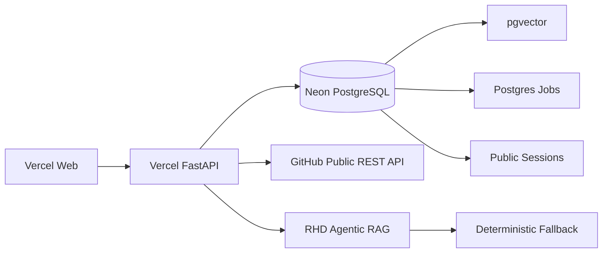

# RepoGuardian Architecture

## Current Implemented System

GitHub
↓
Sync / Monitoring
↓
SQLite or PostgreSQL abstraction
↓
Repository Knowledge Index
↓
Project-Aware RAG
↓
Investigation Orchestrator
↓
Structured Tools
↓
Duplicate / Completeness / Security / Release Analysis
↓
Priority
↓
Selective Escalation
↓
Evidence Validation
↓
RHD Repository Review / Ask RHD
↓
Action Recommendation
↓
Human Review
↓
Policy Validation
↓
Safe GitHub Action
↓
Audit Trail
↓
Maintainer Dashboard

## Runtime Implementation

GitHub access uses `GitHubCliService`, a backend service abstraction over authenticated GitHub CLI. The frontend never shells out to GitHub and never receives credentials.

Repository synchronization upserts repository metadata, issues, comments, pull requests, and releases. Repeated syncs update existing rows instead of duplicating GitHub objects.

The local runtime uses SQLite and local repository-filtered token vectors. The active public cloud architecture uses Vercel Web, Vercel Python serverless FastAPI, Neon PostgreSQL, pgvector, PostgreSQL-backed jobs, and deterministic RHD fallback. Docker is not required for the public demo.

The RAG retriever filters by `repository_id` before scoring. This protects repository isolation and prevents cross-repository evidence leakage.

The investigation orchestrator performs bounded structured stages: load issue, classify, analyze completeness, retrieve repository history, detect duplicates, inspect PRs/releases, detect security signal, analyze release regression, calculate priority, determine escalation, validate evidence, store telemetry, and create an action recommendation.

Prompt 3 intelligence is deterministic by default. `AI_PROVIDER_MODE=auto` reports OpenAI as available only when `OPENAI_API_KEY` is configured; otherwise deterministic intelligence remains active.

Prompt 4 adds human review. Investigations create `ActionRecommendation` rows but do not execute external writes. Maintainers review previews, approve or reject, and execution validates policy again server-side. Supported actions are intentionally limited to safe label/comment/review workflows. The system does not close issues, merge PRs, delete branches, delete issues, or disclose security details.

RHD — Repository Health Director — is the agent layer on top of the existing tools. RHD accepts a GitHub repository URL or `owner/repository`, connects and syncs the repository, builds repository context, runs a bounded initial scan, generates a full repository review, and answers repository-oriented questions through controlled intents. RHD uses deterministic routing when `OPENAI_API_KEY` is not configured. Live language model support remains optional and must stay grounded in tool outputs.

Public repositories are read-only analysis targets in Vercel mode. External writes remain restricted by the existing action recommendation, human approval, allow-list, policy validation path, and `GITHUB_WRITE_MODE=disabled`.

## Current Public Deployment Architecture

Serverless onboarding is staged as `CONNECT`, `SYNC_METADATA`, `SYNC_ISSUES`, `SYNC_PRS`, `SYNC_RELEASES`, `INDEX_DOCUMENTS`, `RAG_PREP`, `HEALTH_ANALYSIS`, `RHD_REVIEW`, and `READY`. Progress is stored in PostgreSQL.

Audit logging is append-oriented and stores safe summaries plus metadata for repository, issue, investigation, action recommendation, actor, event type, and timestamp. It does not store secrets or private reasoning.

## Enterprise Evolution

Future production architecture can add:

- GitHub App authentication and webhooks
- Redis/Kafka queues for higher throughput
- Distributed sync/indexing/investigation workers
- Managed secret storage
- RBAC and organization membership checks
- SSO
- Multi-tenancy
- Observability and alerting
- Evaluation pipelines and drift monitoring
- Enterprise policy engine
- Enterprise audit retention
- Repository comparison using two isolated RHD reviews
- Private repository onboarding through GitHub App installation and fine-grained permissions

These items are roadmap items, not implemented capabilities.
