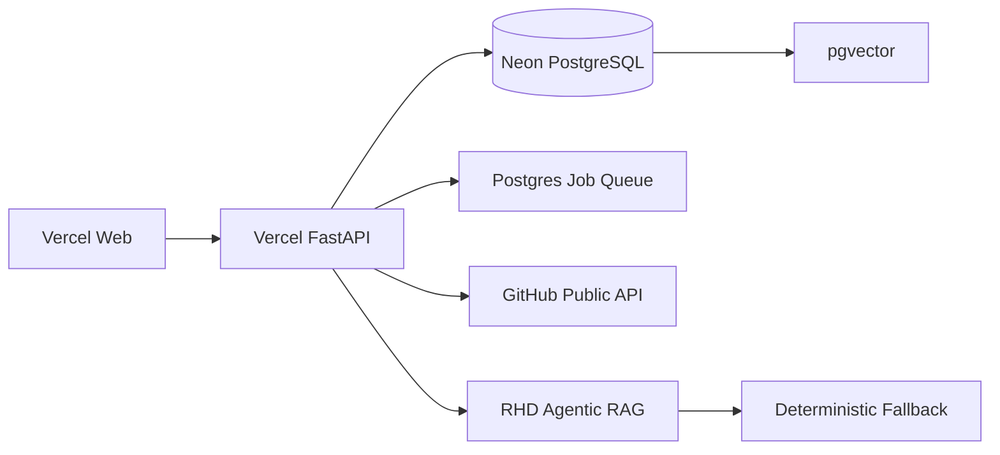

# Managed Cloud Deployment

Status: `VERCEL_NEON_READY_FOR_AUTHORIZATION`.

Primary cloud target:

- Frontend: Vercel Next.js project rooted at `frontend/`.
- Backend: Vercel Python serverless project using root `api/index.py`.
- Database: Neon PostgreSQL through `DATABASE_URL`.
- Vector: pgvector on Neon.
- Queue: PostgreSQL-backed serverless job queue.
- AI: deterministic RHD by default; cloud providers can be added later without blocking deployment.

Render is optional historical documentation only. It is not required for the public deployment.



## Backend Project

Vercel project root: repository root.

Entry point:

```python
api/index.py
```

The entrypoint only imports the existing FastAPI app. Business logic remains under `backend/app`.

Required backend environment:

- `DATABASE_URL`: Neon server-side connection string.
- `DEPLOYMENT_MODE=MANAGED_CLOUD`
- `POSTGRES_RUNTIME_MODE=managed`
- `DATA_BACKEND=postgres`
- `VECTOR_BACKEND=pgvector`
- `QUEUE_BACKEND=postgres`
- `PUBLIC_ANALYSIS_MODE=true`
- `ENABLE_PUBLIC_WRITE_ACTIONS=false`
- `GITHUB_WRITE_MODE=disabled`
- `ENABLE_STARTUP_SCHEMA_CREATE=false`
- `AI_PROVIDER_MODE=auto`
- `DEMO_GITHUB_REPOSITORY=romil569/RepoGuardian-Demo`
- `FRONTEND_URL=<actual frontend Vercel URL>`
- `CORS_ORIGINS=<actual frontend Vercel URL>`

Optional backend secrets:

- `GITHUB_TOKEN`
- `GROQ_API_KEY`
- `OPENROUTER_API_KEY`
- `OPENAI_API_KEY`

Do not set `DATABASE_URL` or provider secrets as `NEXT_PUBLIC_` values.

## Frontend Project

Vercel project root: `frontend/`.

Required frontend environment:

```bash
NEXT_PUBLIC_API_URL=https://your-api.vercel.app
NEXT_PUBLIC_DEMO_GITHUB_REPOSITORY=romil569/RepoGuardian-Demo
```

## Migrations

Do not run Alembic on every serverless request.

Migrations are explicit:

```bash
cd backend
alembic upgrade head
```

The Neon database was already created and validated. Future schema changes should be applied once through a secure local command or a manually approved CI migration job.

## Serverless Runtime Notes

Vercel startup does not start the local scheduler. Repository sync and RHD onboarding use persisted `deployment_jobs` rows and bounded staged advancement.

Public rate limiting is stored in PostgreSQL when `QUEUE_BACKEND=postgres`; local development still uses the in-process fallback.

Cloud mode disables local filesystem code scanning and treats graph relationships as PostgreSQL records. Local graph stores remain available for development tests and code-intelligence tools.

Ollama is local-only. In managed cloud, the model gateway skips localhost and uses deterministic RHD unless a cloud provider key is configured.
