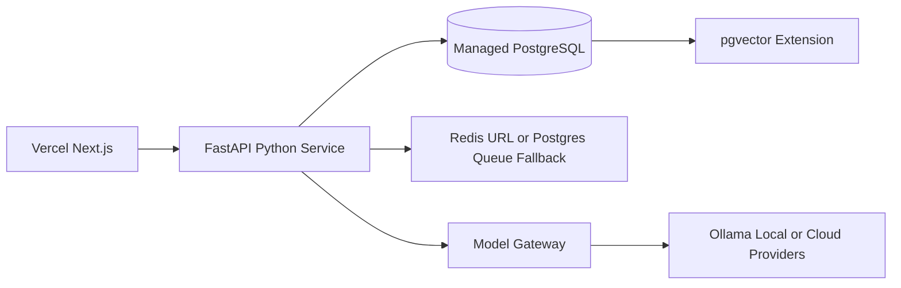

# Managed Cloud Deployment

Status: `MANAGED_CLOUD_READY_NOT_CONNECTED`.

RepoGuardian can run without Docker by splitting deployment into Vercel-compatible frontend hosting, a Python FastAPI service, managed PostgreSQL, optional pgvector, and Redis or Postgres queue fallback.



Backend start command:

```bash
uvicorn app.main:app --host 0.0.0.0 --port $PORT
```

Required backend environment:

- `DATABASE_URL`: provider-neutral PostgreSQL URL.
- `DEPLOYMENT_MODE=MANAGED_CLOUD`
- `POSTGRES_RUNTIME_MODE=managed`
- `FRONTEND_URL`: deployed frontend origin.
- `CORS_ORIGINS`: comma-separated allowed origins when more than one frontend origin is needed.
- `QUEUE_BACKEND=redis` with `REDIS_URL`, or `QUEUE_BACKEND=postgres` as the managed-cloud fallback.

Frontend environment:

```bash
NEXT_PUBLIC_API_URL=https://your-fastapi-service.example.com
```

No backend secrets may use `NEXT_PUBLIC_` variables.

Any standard PostgreSQL provider can be used. Neon is compatible when pgvector is already installed or the database role can run `CREATE EXTENSION vector`.

RepoGuardian checks PostgreSQL connection and pgvector availability through `/api/platform/enterprise-readiness`. If extension creation fails because permissions are insufficient, startup remains non-destructive and reports `PARTIAL`.

No paid services are provisioned automatically.
